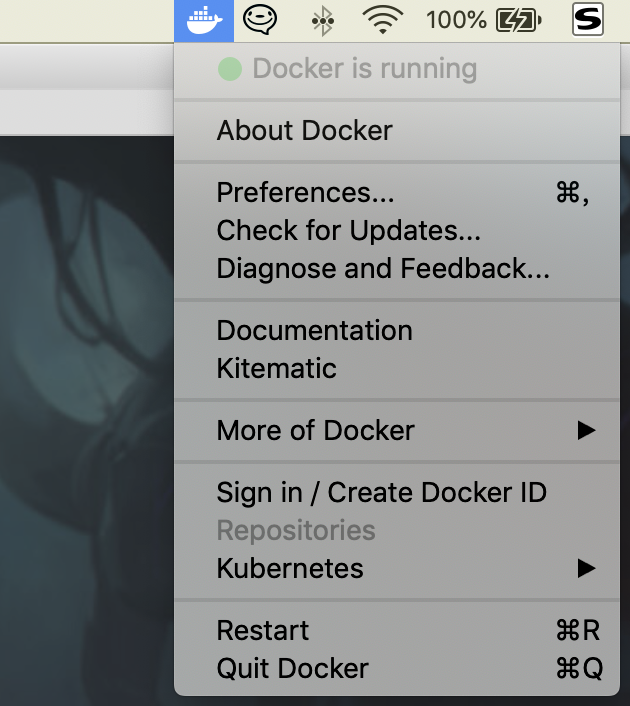
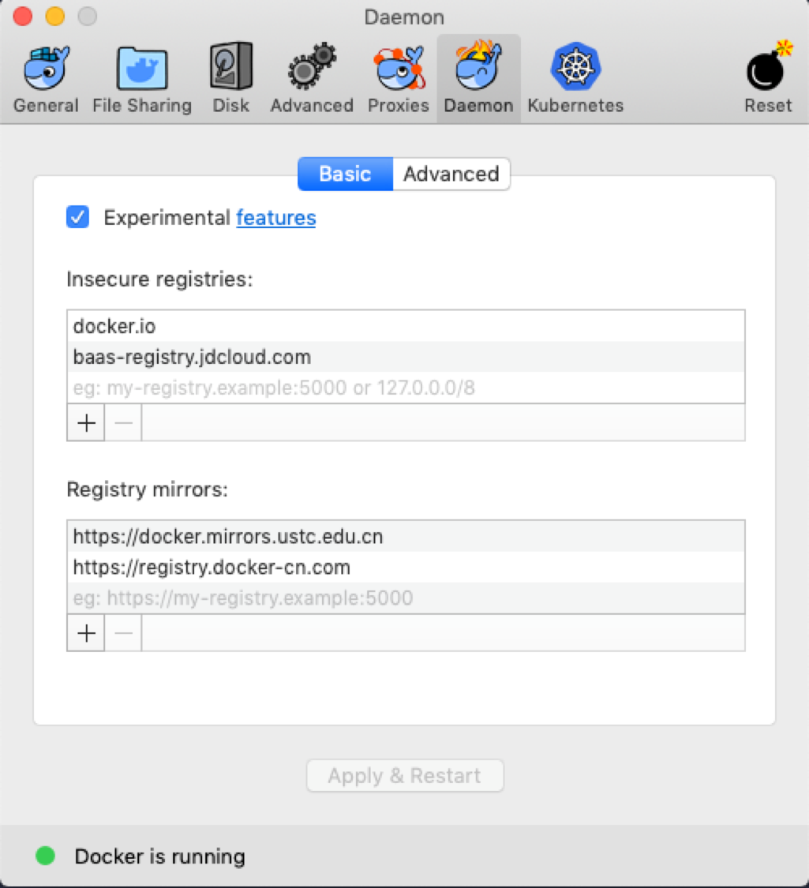

# 问题描述
在安装好 `Docker` 后，`pull`镜像时出现:
`Error response from daemon: Get https://registry-1.docker.io/v2/: net/http: TLS handshake timeout` 
和
`Error response from daemon: Get https://registry-1.docker.io/v2/: net/http: request canceled` 
问题。有可能是因为源导致的。国外的源访问超时
此时需要将镜像源改为国内的即可，有两种方式：
1. 修改 `/etc/docker/daemon.json`
```json
{
	"registry-mirrors": ["https://l10nt4hq.mirror.aliyuncs.com"]
}
```
2. 修改或新增 `/etc/sysconfig/docker`
在 `OPTIONS` 变量后追加参数 `--registry-mirror=https://docker.mirrors.ustc.edu.cn`
```shell
#vi /etc/sysconfig/docker
OPTIONS='--selinux-enabled --log-driver=journald --registry-mirror=https://docker.mirrors.ustc.edu.cn'
```
使用 `mac` 环境
点击右上方的图标，打开 `Preferences` - `Daemon` - `Basic`，在 `Registry mirrors` 中输入 `docker.mirrors.ustc.edu.cn`，根据需要可以添加多个。然后选择 `Apply & Restart`。图示如下：


然后就可以正常的拉取镜像了。

# 添加时区
```dockerfile
RUN apk --update add tzdata \
	&& cp /usr/share/zoneinfo/Asia/Shanghai /etc/localtime \
    && echo "Asia/Shanghai" > /etc/timezone \
    && apk del tzdata
```

# Docker国内的几个源
Docker 官方中国区：https://registry.docker-cn.com
网易：http://hub-mirror.c.163.com
中国科技大学：https://docker.mirrors.ustc.edu.cn
阿里云：https://pee6w651.mirror.aliyuncs.com

# Docker-compose
[How to understand building images with docker-compose](https://medium.com/@zhao.li/how-to-understand-building-images-with-docker-compose-24cbdbc0641f)
[ARG or ENV, which one to use in this case?](https://stackoverflow.com/questions/41916386/arg-or-env-which-one-to-use-in-this-case)
[DockerFile 设置环境变量](https://www.jianshu.com/p/ae634ffb21ff)


# 拉取 docker.pkg.github.com 上的镜像

参考链接：[Configuring Docker for use with GitHub Packages](https://docs.github.com/en/packages/using-github-packages-with-your-projects-ecosystem/configuring-docker-for-use-with-github-packages#authenticating-to-github-packages)

首先需要生成一个token，

* 登录github.com，点击个人头像，选择下拉菜单中的 "settings"
* 在最左侧一栏的点击 "Developer settings"
* 在新页面中，选择左侧栏的 “Personal access tokens"
* 在右侧点击 ”Generate a personal access token“链接
* 然后在新页面中勾选需要的权限，点击下面的绿色按钮”Generate Token“。
* 然后将生成的token复制下来，保存到本地

在本地登录 github

```shell
$ cat ~/TOKEN.txt | docker login https://docker.pkg.github.com -u USERNAME --password-stdin
```

其中 `USERNAME` 为github.com上面的账号，此时会有如下的登录成功标识：

```shell
Login Succeeded
```

然后就可以拉取 `github.com` 上面的镜像了，如下：

```shell
docker pull docker.pkg.github.com/{organization}/{projectName}/{images}:{tags}
```

