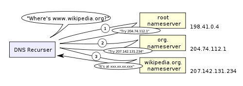
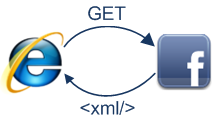

**原文** [what-really-happens-when-you-navigate-to-a-url](http://igoro.com/archive/what-really-happens-when-you-navigate-to-a-url/)

作为一个软件开发人员，您当然可以全面了解 WEB 应用程序的工作方式以及所涉及的技术：浏览器，HTTP，HTML，Web服务器，请求处理等。

在本文中，我们将更深入地研究访问 URL 时发生的事件及顺序

### 1. 在浏览器中输入一个 URL

一切都是从这里开始：


 ### 2. 浏览器查找域名的 IP 地址

导航的第一步是找出访问域的IP地址。DNS 查找过程如下：

* **浏览器缓存** - 浏览器缓存 DNS 记录一段时间。有趣的是，操作系统不会告诉浏览器每个DNS记录的生存时间，因此浏览器会将它们缓存固定的持续时间（不同浏览器之间的间隔为2到30分钟）。

- **操作系统缓存** –如果浏览器缓存不包含所需的记录，则浏览器会进行系统调用（Windows中为gethostbyname）。操作系统具有自己的缓存。
- **路由器缓存** -请求继续到您的路由器，该路由器通常具有自己的DNS缓存。
- **ISP DNS缓存** –下一个要检查的地方是缓存ISP的DNS服务器。具有缓存，自然。
- **递归搜索** –您的ISP的DNS服务器开始从根名称服务器到.com顶级名称服务器再到Facebook的名称服务器的递归搜索。通常，DNS服务器在缓存中将具有.com名称服务器的名称，因此无需对根名称服务器进行匹配。

这里是递归 DNS 搜索的示意图：



> 关于DNS的一件令人担忧的事情是，整个域（例如wikipedia.org或facebook.com）似乎都映射到一个IP地址。幸运的是，有一些缓解瓶颈的方法：
>
> - **轮询DNS**是一种DNS查找返回多个IP地址而不是一个IP地址的解决方案。例如，facebook.com实际上映射到四个IP地址。
> - **负载平衡器**是侦听特定IP地址并将请求转发到其他服务器的硬件。主要站点通常会使用昂贵的高性能负载平衡器。
> - **地理DNS**通过将域名映射到不同的IP地址来提高可伸缩性，具体取决于客户端的地理位置。这对于托管静态内容非常有用，因此不同的服务器不必更新共享状态。
> - **Anycast**是一种路由技术，其中单个IP地址映射到多个物理服务器。不幸的是，任播不能很好地适合TCP，在这种情况下很少使用。

> 大部分 DNS 服务器本身都使用任播， 以实现 **DNS** 查找的高可用性和低延迟。

### 3. 浏览器将HTTP请求发送到Web服务器


您可以肯定的是，不会从浏览器缓存中提供Facebook主页，因为动态页面会很快或立即过期（将过期日期设置为过去）。

因此，浏览器会将此请求发送到Facebook服务器：

```http
GET http://facebook.com/ HTTP/1.1
Accept: application/x-ms-application, image/jpeg, application/xaml+xml, [...]
User-Agent: Mozilla/4.0 (compatible; MSIE 8.0; Windows NT 6.1; WOW64; [...]
Accept-Encoding: gzip, deflate
Connection: Keep-Alive
Host: facebook.com
Cookie: datr=1265876274-[...]; locale=en_US; lsd=WW[...]; c_user=2101[...]
```

GET请求将要获取的**URL**命名为**：** “ http://facebook.com/”。浏览器标识自己（**User-Agent**标头），并声明它将接受的响应类型（**Accept**和**Accept-Encoding**标头）。该**连接**头要求服务器保持TCP连接开放以处理进一步请求。

该请求还包含浏览器针对该域的**cookie**。您可能已经知道，cookie是键值对，它们在不同页面请求之间跟踪网站的状态。因此，cookie会存储登录用户的名称，服务器分配给该用户的密码，用户的某些设置等。这些cookie将存储在客户端的文本文件中，并在每次请求时发送给服务器处理。

> 有多种工具可让您查看原始HTTP请求和相应的响应。我最喜欢的用于查看HTTP原始流量的工具是[fiddler](http://www.fiddler2.com/fiddler2/)，但还有许多其他工具（例如FireBug），这些工具在优化站点时非常有用。

> 除了GET请求之外，您可能还熟悉的另一种请求是POST请求，通常用于提交表单。GET请求通过URL发送其参数（例如：http://robozzle.com/puzzle.aspx?**id = 85**）。POST请求在标头下的请求正文中发送其参数。

> URL “http://facebook.com/”中的斜杠很重要。在这种情况下，浏览器可以安全地添加斜杠。对于格式为http://example.com/folderOrFile的URL，浏览器无法自动添加斜杠，因为不清楚folderOrFile是文件夹还是文件。在这种情况下，浏览器将在不带斜杠的情况下访问URL，并且服务器将通过重定向进行响应，从而导致不必要的往返。

### 4. Facebook 服务器以永久重定向响应


这是Facebook服务器发送回浏览器请求的响应：

```http
HTTP/1.1 301 Moved Permanently
Cache-Control: private, no-store, no-cache, must-revalidate, post-check=0,
      pre-check=0
Expires: Sat, 01 Jan 2000 00:00:00 GMT
Location: http://www.facebook.com/
P3P: CP="DSP LAW"
Pragma: no-cache
Set-Cookie: made_write_conn=deleted; expires=Thu, 12-Feb-2009 05:09:50 GMT;
      path=/; domain=.facebook.com; httponly
Content-Type: text/html; charset=utf-8
X-Cnection: close
Date: Fri, 12 Feb 2010 05:09:51 GMT
Content-Length: 0
```

服务器以301永久移动响应作为响应，告诉浏览器转到“ http://www.facebook.com/”而不是“ http://facebook.com/”。

> 服务器坚持重定向而不是立即响应用户想要查看的网页的原因很有趣。
>
> 原因之一与**搜索引擎排名有关**。请参阅，如果同一页面有两个URL，例如http://www.igoro.com/和http://igoro.com/，搜索引擎可能会将其视为两个不同的站点，每个站点的传入链接和因此排名较低。搜索引擎了解永久重定向（301），并将来自两个来源的传入链接合并到一个排名中。
>
> 同样，相同内容的多个URL也不**适合缓存**。当一条内容具有多个名称时，它可能会在缓存中多次出现。

### 5.浏览器遵循重定向


浏览器现在知道“ http://www.facebook.com/”是要访问的正确URL，因此它发出另一个GET请求：

```http
GET http://www.facebook.com/ HTTP/1.1
Accept: application/x-ms-application, image/jpeg, application/xaml+xml, [...]
Accept-Language: en-US
User-Agent: Mozilla/4.0 (compatible; MSIE 8.0; Windows NT 6.1; WOW64; [...]
Accept-Encoding: gzip, deflate
Connection: Keep-Alive
Cookie: lsd=XW[...]; c_user=21[...]; x-referer=[...]
Host: www.facebook.com
```

标头的含义与第一个请求的含义相同。

### 6.服务器“处理”请求


服务器将接收GET请求，对其进行处理，然后发送回响应。

这似乎是一项简单的任务，但实际上，这里发生了很多有趣的事情-即使在像我的博客这样的简单网站上，更不用说在诸如Facebook之类的可大规模扩展的网站上了。

- Web服务器软件

    Web服务器软件（例如IIS或Apache）接收HTTP请求，并决定应执行哪个请求处理程序来处理此请求。请求处理程序是一个程序（在ASP.NET，PHP，Ruby中，…），用于读取请求并生成响应的HTML。

    在最简单的情况下，请求处理程序可以存储在文件层次结构中，该文件层次结构的结构与URL结构类似，因此例如 http://example.com/folder1/page1.aspx URL将映射到文件 /httpdocs/folder1/page1.aspx。还可以配置Web服务器软件，以便将URL手动映射到请求处理程序，因此page1.aspx的公共URL可以为http://example.com/folder1/page1。

- **请求处理程序
    **请求处理程序读取请求，其参数和cookie。它将读取并可能更新存储在服务器上的某些数据。然后，请求处理程序将生成HTML响应。

> 每个动态网站面临的一个有趣的难题是如何存储数据。较小的站点通常将只有一个SQL数据库来存储其数据，但是存储大量数据和/或具有许多访问者的站点必须找到一种在多台计算机之间拆分数据库的方法。解决方案包括分片（基于主键在多个数据库之间拆分表），复制以及使用具有弱一致性语义的简化数据库。

> 使数据更新便宜的一种技术是将某些工作推迟到批处理工作中。例如，Facebook必须及时更新新闻源，但是支持“您可能认识的人”功能的数据可能只需要每晚进行更新（我想，我实际上并不知道他们如何实现此功能）。批处理作业更新会导致一些不太重要的数据过时，但可以使数据更新更快，更简单。

### 7.服务器发回HTML响应


这是服务器生成并发送回的响应：

```http
HTTP/1.1 200 OK
Cache-Control: private, no-store, no-cache, must-revalidate, post-check=0,
    pre-check=0
Expires: Sat, 01 Jan 2000 00:00:00 GMT
P3P: CP="DSP LAW"
Pragma: no-cache
Content-Encoding: gzip
Content-Type: text/html; charset=utf-8
X-Cnection: close
Transfer-Encoding: chunked
Date: Fri, 12 Feb 2010 09:05:55 GMT

2b3
��������T�n�@����[...]
```

整个响应为36 kB，其中大部分位于我修整的字节blob中。

**Content-Encoding**头告诉浏览器，响应体用gzip算法压缩。解压缩Blob之后，您将看到所需的HTML：

```html
<!DOCTYPE html PUBLIC "-//W3C//DTD XHTML 1.0 Strict//EN"   
      "http://www.w3.org/TR/xhtml1/DTD/xhtml1-strict.dtd">
<html xmlns="http://www.w3.org/1999/xhtml" xml:lang="en" 
      lang="en" id="facebook" class=" no_js">
<head>
<meta http-equiv="Content-type" content="text/html; charset=utf-8" />
<meta http-equiv="Content-language" content="en" />
...
```

除了压缩外，标头还指定是否以及如何缓存页面，要设置的任何cookie（此响应中没有），隐私信息等。

> 注意将**Content-Type设置**为**text/html**的标题。标头指示浏览器将响应内容呈现为HTML，而不是说将其下载为文件。浏览器将使用标头来决定如何解释响应，但也会考虑其他因素，例如URL的扩展。

### 8.浏览器开始呈现HTML

甚至在浏览器收到整个HTML文档之前，它就开始呈现该网站：


### 9.浏览器发送对嵌入HTML的对象的请求


当浏览器呈现HTML时，它将注意到需要获取其他URL的标记。浏览器将发送GET请求以检索每个文件。

这是我访问facebook.com时检索到的一些URL：

- **图片
    **http://static.ak.fbcdn.net/rsrc.php/z12E0/hash/8q2anwu7.gif
    http://static.ak.fbcdn.net/rsrc.php/zBS5C/hash/7hwy7at6.gif
    ...
- **CSS样式表
    **http://static.ak.fbcdn.net/rsrc.php/z448Z/hash/2plh8s4n.css
    http://static.ak.fbcdn.net/rsrc.php/zANE1/hash/cvtutcee.css
    ...
- **JavaScript文件**
    http://static.ak.fbcdn.net/rsrc.php/zEMOA/hash/c8yzb6ub.js
    http://static.ak.fbcdn.net/rsrc.php/z6R9L/hash/cq2lgbs8.js
    ...

这些URL中的每一个都将经历与HTML页面相似的过程。因此，浏览器将在DNS中查找域名，向URL发送请求，跟随重定向等。

但是，与动态页面不同，静态文件使浏览器可以缓存它们。某些文件可能是从缓存中提供的，根本没有联系服务器。浏览器知道缓存特定文件的时间，因为返回该文件的响应包含Expires标头。此外，每个响应还可能包含一个ETag标头，其作用类似于版本号–如果浏览器看到已具有该文件版本的ETag，它可以立即停止传输。

> 您能猜出网址中的**“ fbcdn.net”**代表什么吗？可以肯定的是，它的意思是“ Facebook内容交付网络”。Facebook使用内容分发网络（CDN）分发静态内容-图像，样式表和JavaScript文件。因此，文件将被复制到全球的许多计算机上。
>
> 静态内容通常代表站点带宽的大部分，并且可以轻松地跨CDN复制。通常，站点将使用第三方CDN提供程序，而不是自己操作CND。例如，Facebook的静态文件由最大的CDN提供商Akamai托管。
>
> 作为演示，当您尝试ping static.ak.fbcdn.net时，您将从akamai.net服务器获得响应。同样，有趣的是，如果您两次ping URL，则可能会收到来自不同服务器的响应，这表明了在后台发生的负载平衡。

### 10.浏览器进一步发送异步（AJAX）请求




本着Web 2.0的精神，即使呈现页面后，客户端仍继续与服务器通信。

例如，Facebook聊天会随着来回的来继续更新您登录的朋友的列表。要更新已登录朋友的列表，在浏览器中执行的JavaScript必须向服务器发送异步请求。异步请求是通过程序构造的GET或POST请求，它会转到一个特殊的URL。在Facebook示例中，客户端将POST请求发送到http://www.facebook.com/ajax/chat/buddy_list.php，以获取在线朋友的列表。

这种模式有时称为“ AJAX”，代表“异步JavaScript和XML”，即使没有特殊原因，服务器必须将响应格式化为XML。例如，Facebook返回JavaScript代码段以响应异步请求。

> 除其他外，提琴手工具使您可以查看浏览器发送的异步请求。实际上，您不仅可以被动地观察请求，还可以修改并重新发送它们。如此容易“欺骗” AJAX请求这一事实使带计分板的在线游戏开发人员倍感悲痛。（显然，请不要那样作弊。）

> Facebook聊天提供了一个有关AJAX有趣问题的示例：将数据从服务器推送到客户端。由于HTTP是请求-响应协议，因此聊天服务器无法将新消息推送到客户端。相反，客户端必须每隔几秒钟轮询一次服务器，以查看是否有新消息到达。
>
> 在这些类型的方案中，[长轮询](http://en.wikipedia.org/wiki/Push_technology#Long_polling)是一种有趣的技术，可以减少服务器上的负载。如果服务器在轮询时没有任何新消息，则仅不发送回响应。并且，如果在超时时间内收到此客户端的消息，则服务器将找到未完成的请求并返回带有响应的消息。

### 结论

希望这可以使您更好地了解不同Web片段如何协同工作。

> 阅读更多我的文章：
>
> [Gallery of processor cache effects](http://igoro.com/archive/gallery-of-processor-cache-effects/)
>
> [Human heart is a Turing machine, research on XBox 360 shows. Wait, what?](http://igoro.com/archive/human-heart-is-a-turing-machine-research-on-xbox-360-shows-wait-what/)
>
> [Self-printing Game of Life in C#](http://igoro.com/archive/self-printing-game-of-life-in-c/)
>
> [Skip lists are fascinating!](http://igoro.com/archive/skip-lists-are-fascinating/)
>
> 如果您喜欢我的博客，请[订阅](http://igoro.com/feed/)！

