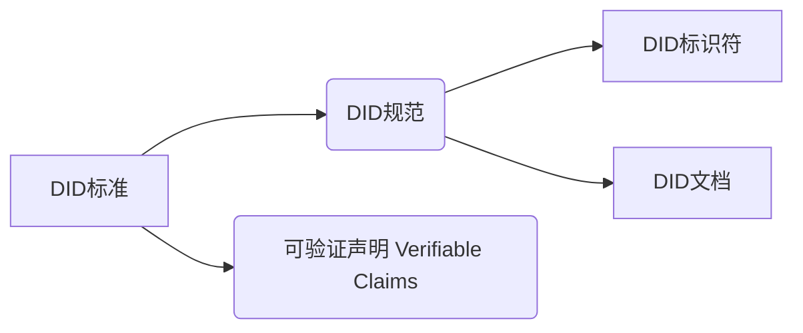

身份：一组与实体关联的属性

数字身份通常由身份标识符和与之关联的属性声明来表示

分布式身份包括：分布式身份标识符和数字身份凭证（声明集合）

声明（claims）： 是指与身份关联的属性信息，通常包括：姓名，电子邮件是址，年龄，职业等。可是一个身份所有者自己发出的，也可以是由其他声明发行人发出的。

* 可验证声明：声明由发生人签出的。
* 凭证（credentials）: 多项声明的集合。

W3C的DID标准下的DID系统主要包括以下层次：

DID格式

