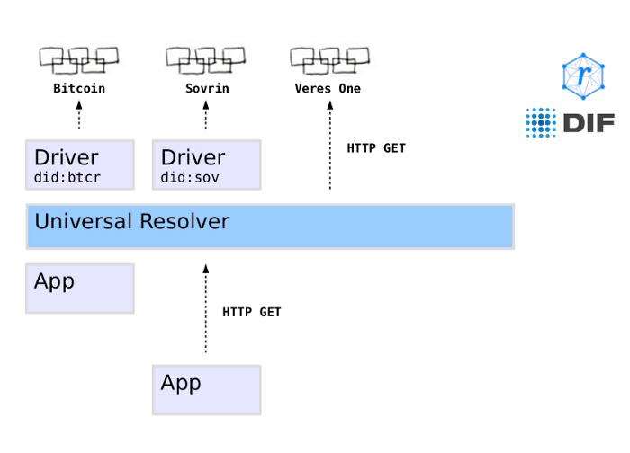

[A Universal Resolver for self-sovereign identifiers](https://medium.com/decentralized-identity/a-universal-resolver-for-self-sovereign-identifiers-48e6b4a5cc3c)

DIF is introducing a community preview of the Universal Resolver — a core building block of a decentralized identity system. This is a first step in fulfilling DIF’s mission to help individuals and organizations to control their digital identity, without being dependent on any intermediary party.

This tool fulfills a similar purpose as Bind does in the DNS system: resolution of identifiers. However, instead of working with domain names, we work with self-sovereign identifiers that can be created and registered directly by the entities they refer to. This is important, because identifiers are the basis for any identity and communications system — without identifiers, we cannot have relationships, transactions, data sharing or messaging between entities. Historically identifiers have always been assigned to us by some kind of corporate or state authority. The Universal Resolver lets us build architectures and protocols on top of identifiers that are completely self-sovereign. There is no longer a need for a central authority to issue, maintain and revoke identifiers.

However, just having an identifier is not enough. We need some further information in order to know how to communicate with the entity represented by the identifier. The job of a “Resolver” is to discover and retrieve this further information. At a minimum, this information includes elements such as service endpoints for communicating with the entity, as well as the cryptographic keys associated with it. The Universal Resolver performs this task to enable the basic building blocks of a self-sovereign identity world.

The Universal Resolver is directly related to the work that has been done by the [Rebooting-the-Web-of-Trust](http://weboftrust.info/) and [Internet Identity Workshop](http://internetidentityworkshop.com/) communities around a [Decentralized Public Key Infrastructure (DPKI)](https://www.google.at/url?sa=t&rct=j&q=&esrc=s&source=web&cd=1&cad=rja&uact=8&ved=0ahUKEwiL6LSByozXAhWEVBQKHbE_BqEQFgg8MAA&url=http%3A%2F%2Fwww.weboftrust.info%2Fdownloads%2Fdpki.pdf&usg=AOvVaw2YDgvyMxhMRmOv6MH8dfaK) and [Decentralized Identifiers (DIDs)](https://w3c-ccg.github.io/did-spec/), which support different “methods” for registering identifiers on decentralized systems such as the Bitcoin blockchain, Sovrin, Ethereum, IPFS, and others. Note that the DID spec is currently undergoing a “hardening” phase, and that the work presented here is an early developers’ implementation meant to encourage the participation of the community and to accelerate the joint development of key decentralized identity primitives.

# Extensible Driver Architecture

DIF’s Universal Resolver provides a unified interface which can be used to resolve any kind of decentralized identifier. This enables higher level data formats (such as Verifiable Claims) and protocols (such as DIF’s Hub protocol) to be built on top of the identifier layer, no matter which blockchain or other system has been used to register the identifier. Internally, the Universal Resolver achieves this through an architecture consisting of “drivers” for each supported identifier type. A driver can be easily added via a Docker container, a Java API, or a remote HTTP GET call, as illustrated in the following diagram:



Currently, early versions of the following drivers exist. They will be updated regularly to match the progress of the various specification documents:

- **did:sov**, registered on the [Sovrin](https://sovrin.org/) distributed ledger
- **did:btcr**, registered on the [Bitcoin](https://github.com/WebOfTrustInfo/btcr-hackathon/blob/master/README.md) blockchain
- **did:stack**, used by [Blockstack](http://blockstack.org/) (thank you Jude Nelson !)
- **did:uport**, used by [uPort](https://www.uport.me/) (thank you Christian Lundqvist !)
- **did:jolo**, used by [Jolocom](https://jolocom.io/) (thank you Charles Cunningham !)
- **did:ipid**, using [IPFS and IPNS](https://github.com/jonnycrunch/ipid) (thank you Jonathan Holt !)
- **did:v1**, used by [Veres One](https://veres.one/)

Drivers can internally function in different ways — some drivers may simply call a remote web service, while others may have direct access to a full node of the blockchain they use. The former option can make the driver usable even on mobile devices, while the latter option provides higher security guarantees for the resolution result.

# How can I deploy/use the Universal Resolver?

An easy way to get started on your local machine is to clone the following Github repository, and use **docker-compose** to build and run the Universal Resolver as well as its drivers:

```
git clone https://github.com/decentralized-identity/universal-resolver.git
cd universal-resolver/
docker-compose -f docker-compose.yml pull
docker-compose -f docker-compose.yml up
```

You should then be able to resolve identifiers locally using simple **curl** requests as follows:

```
curl -X GET http://localhost:8080/1.0/identifiers/did:sov:WRfXPg8dantKVubE3HX8pw
curl -X GET http://localhost:8080/1.0/identifiers/did:btcr:xkrn-xzcr-qqlv-j6sl
curl -X GET http://localhost:8080/1.0/identifiers/did:v1:test:nym:3AEJTDMSxDDQpyUftjuoeZ2Bazp4Bswj1ce7FJGybCUu
curl -X GET http://localhost:8080/1.0/identifiers/did:uport:2omWsSGspY7zhxaG6uHyoGtcYxoGeeohQXz
curl -X GET http://localhost:8080/1.0/identifiers/did:jolo:e76fb4b4900e43891f613066b9afca366c6d22f7d87fc9f78a91515be24dfb21
curl -X GET http://localhost:8080/1.0/identifiers/did:stack:v0:16EMaNw3pkn3v6f2BgnSSs53zAKH4Q8YJg-0
curl -X GET http://localhost:8080/1.0/identifiers/did:ipid:QmYA7p467t4BGgBL4NmyHtsXMoPrYH9b3kSG6dbgFYskJm
```

The response to these calls will be the DID Document, containing service endpoints and cryptographic keys associated with the entity the DID refers to.

# Next Steps

We are now working on the following improvements and additional resources:

- At the moment, the Universal Resolver simply accepts an identifier as input, and returns the DID Document as a result. In the future, more advanced input options (such as queries for certain services or keys), as well as additional result information (such as “supplementary” details about the resolution process) can be supported.
- We are working on client libraries in Java, Python, and NodeJS that will make it easy to access an instance of the Universal Resolver remotely (thank you Kyle Den Hartog and James Foley !)
- We will formulate guidelines and recommendations for the community on how to contribute a new driver for a new type of decentralized identifier.
- We will integrate the Universal Resolver with our work on Hubs, which allow storing and sharing of personal identity objects and files.
- And last but not least, we are designing a component that will allow not only resolution, but also registration of decentralized identifiers. We call this the Universal Registrar — stay tuned!

------

To learn more about DIF’s Universal Resolver, see https://github.com/decentralized-identity/universal-resolver/.

To learn more about DIDs, see https://w3c-ccg.github.io/did-spec/.

To visit DIF, see http://identity.foundation/.