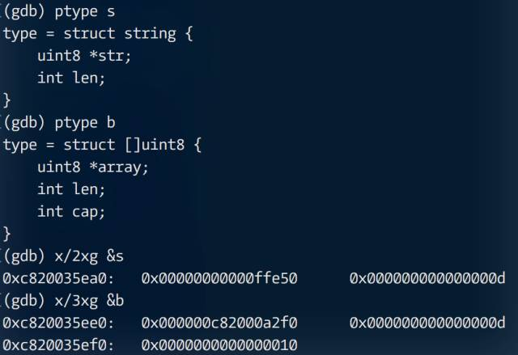
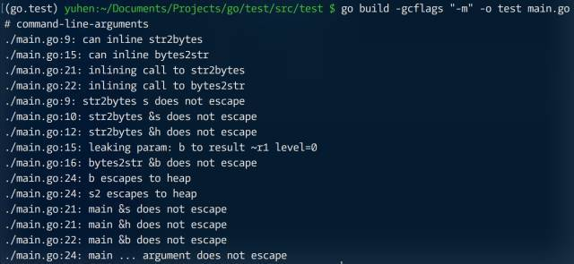
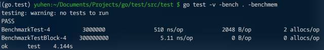

**原文** [Go性能优化技巧 1/10](https://segmentfault.com/a/1190000005006351)

字符串（string）作为一种不可变类型，在与字节数组（slice, [ ]byte）转换时需付出 “沉重” 代价，根本原因是对底层字节数组的复制。这种代价会在以万为单位的高并发压力下迅速放大，所以对它的优化常变成 “必须” 行为。

首先，须了解 string 和 [ ]byte 数据结构，并确认默认方式的复制行为。

```go
package main
 
import (
    "fmt"
)
 
func main() {
    s := "hello, world!"
    b := []byte(s)
    fmt.Println(s, b)
}
```



> 动态演示: https://asciinema.org/a/6up6gvgqo0v9zkjpusvyucg8g

从 GDB 输出结果可看出，转换后 [ ]byte 底层数组与原 string 内部指针并不相同，以此可确定数据被复制。那么，如不修改数据，仅转换类型，是否可避开复制，从而提升性能？

从 ptype 输出的结构来看，string 可看做 [2]uintptr，而 [ ]byte 则是 [3]uintptr，这便于我们编写代码，无需额外定义结构类型。如此，str2bytes 只需构建 [3]uintptr{ptr, len, len}，而 bytes2str 更简单，直接转换指针类型，忽略掉 cap 即可。

```go
package main
 
import (
    "fmt"
    "strings"
    "unsafe"
)
 
func str2bytes(s string) []byte {
    x := (*[2]uintptr)(unsafe.Pointer(&s))
    h := [3]uintptr{x[0], x[1], x[1]}
    return *(*[]byte)(unsafe.Pointer(&h))
}
 
func bytes2str(b []byte) string {
    return *(*string)(unsafe.Pointer(&b))
}
 
func main() {
    s := strings.Repeat("abc", 3)
    b := str2bytes(s)
    s2 := bytes2str(b)
    fmt.Println(b, s2)
}
```

用 unsafe 完成指针类型转换，所以得自行为底层数组生命周期做出保证。好在这两个函数都很简单，编译器会完成内联处理，并未发生逃逸行为。



对比一下优化前后的性能差异。

```go
package main
 
import (
    "strings"
    "testing"
)
 
var s = strings.Repeat("a", 1024)
 
func test() {
    b := []byte(s)
    _ = string(b)
}
 
func test2() {
    b := str2bytes(s)
    _ = bytes2str(b)
}
 
func BenchmarkTest(b *testing.B) {
    for i := 0; i < b.N; i++ {
        test()
    }
}
 
func BenchmarkTestBlock(b *testing.B) {
    for i := 0; i < b.N; i++ {
        test2()
    }
}
```



性能提升明显，最关键的是 zero-garbage。
