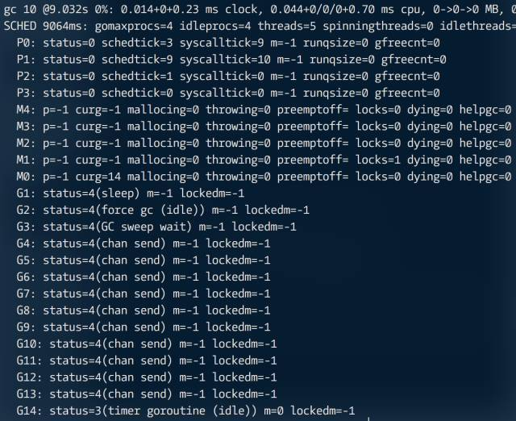

**垃圾回收不是万能的，Go 一样存在资源泄露问题。**

### 1. SetFinalizer

虽然垃圾回收器能很好地处理循环引用，可一旦加上 SetFinalizer，事情就不那么美妙了。

```go
package main

import (
  "runtime"
  "time"
)

type X struct {
  data[1<<20]byte
  ptr *x
}

func test(){
  var a, b X
  a.ptr = &b
  b.ptr = &a
  
  runtime.SetFinalizer(&a, func(*X){println("a fina.")})
  runtime.SetFinalizer(&b, func(*X){println("a fina.")})
}

func main(){
  for i := 0; i < 100; i++ {
    test()
  }
  
  for i := 0; i < 10; i++ {
    runtime.GC()
    time.Sleep(time.Second)
  }
}
```


显然，这些对象并未被释放。在标准库文档里有这样的描述：

> Finalizers are run in dependency order: if A points at B, both have finalizers, and they are otherwise unreachable, only the finalizer for A runs; once A is freed, the finalizer for B can run. If a cyclic structure includes a block with a finalizer, that cycle is not guaranteed to be garbage collected and the finalizer is not guaranteed to run, because there is no ordering that respects the dependencies.

好在这类状况并不常见，SetFinalizer 最大的问题是延长了对象生命周期。在第一次回收时执行 Finalizer 函数，且目标对象重新变成可达状态，直到第二次才真正 “销毁”。这对于有大量对象分配的高并发算法，可能会造成很大麻烦。

> SetFinalizer sets the finalizer associated with x to f. When the garbage collector finds an unreachable block with an associated finalizer, it clears the association and runs f(x) in a separate goroutine. This makes x reachable again, but now without an associated finalizer. Assuming that SetFinalizer is not called again, the next time the garbage collector sees that x is unreachable, it will free x.

### 2.Goroutine Leak
无论是同步通道（channel），还是带缓冲区的异步通道。当条件不满足时，都会进入等待队列休眠，直到被另一方唤醒。可如果没有被唤醒，那么会出什么问题？

```go
package main

import (
  "runtime"
  "time"
)

func test() {
  c := make(chan int)
  
  // go func(){
  // 	for range c {
  //  }
  // }()
	
  for i := 0; i < 10; i++ {
    go func(){
      c <- 1
    }()
  }
}

func main(){
  test()
  
  for i := 0; i < 10; i++ {
    runtime.GC()
    time.Sleep(time.Second)
  }
}
```

这是个极简单的演示，我们注释掉数据读取方，让发送方全部进入休眠等待状态。按理说，当 test 执行结束后，通道 c 已超出作用域，理应被释放回收，但实际情况是：



这些处于 “chan send” 状态的 G 对象（goroutine）会一直存在，直到唤醒或进程结束，这就是所谓的 “Goroutine Leak”。解决方法很简单，可设置 timeout。或定期用 runtime.Stack 扫描所有 goroutine 调用栈，如果发现某个 goroutine 长时间（阈值）处于 “chan send” 状态，可用一个类似 “/dev/null hole” 的接收器负责唤醒并 “处理” 掉相关数据。

```go
func test() {
  c := make(chan int)
  
  // go func(){
  // 	for range c {
  //  }
  // }()
	
  for i := 0; i < 10; i++ {
    go func(){
      select {
      case c <- 1:
        case <- time.After(time.Second * 2):  
      }
    }()
  }
}
```


任何机制都有覆盖不到的地方，这就要求我们对底层的某些实现方式有所了解，同时进行严格测试。
