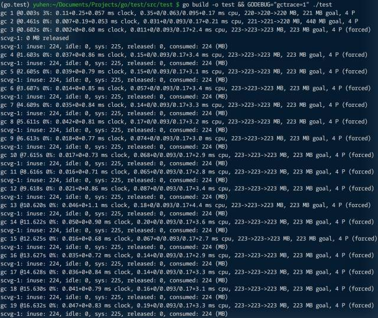

内置 map 类型是必须的。首先，该类型使用频率很高；其次，可借助 runtime 实现深层次优化（比如说字符串转换，以及 GC 扫描等）。可尽管如此，也不意味着万事大吉，依旧有很多需特别注意的地方。

1.预设容量

map 会按需扩张，但须付出数据拷贝和重新哈希成本。如有可能，应尽可能预设足够容量空间，避免此类行为发生。

```go
package main

import (
  "testing"
)

func test(m map[int]int){
  for i := 0; i < 10000; i++ {
    m[i] = i
  }
}

func BenchmarkMap(b *testing.B){
  for i := 0; i < b.N; i++ {
    b.StopTimer()
    m := make(map[int]int)
    b.StartTimer()
    
    test(m)
  }
}

func BenchmarkMap(b *testing.B){
  for i := 0; i < b.N; i++ {
    b.StopTimer()
    m := make(map[int]int, 10000)
    b.StartTimer()
    
    test(m)
  }
}
```


从结果看，预设容量的 map 显然性能更好，更极大减少了堆内存分配次数。

2.直接存储

对于小对象，直接将数据交由 map 保存，远比用指针高效。这不但减少了堆内存分配，关键还在于垃圾回收器不会扫描非指针类型 key/value 对象。

写个示例对比一下，注意调整 33 行的函数调用。

```go
package main

import(
	"time"
  "runtime"
)

const capacity = 500000
var d interface{} // 确保对象存活

func value()interface{}{
  m := make(map[int]int, capacity)
  
  for  i := 0; i < capacity; i++ {
    m[i] = i
  }
  
  return m
}

func pointer() interface{}{
  m := make(map[int]*int, capacity)
  
  for i :=  0; i < capacity; i++ {
    v := i
    m[i] = &v
  }
  
  return m
}

func main(){
  d = pointer()  // d = value()
  
  for i := 0; i < 20; i++ {
    runtime.GC()
    time.Sleep(time.Second)
  }
}
```

指针模式：


值模式：


从两次输出里 GC 所占时间百分比，就可看出 “巨大” 差异。

> 提示：map 对 key、value 数据存储长度有限制。
>
> ```go
> /*
> 	runtime/hashmap.go
> 	
> 	// Maximum key or  value size to keep inline (instead of amllocing per element).
> 	maxKeysize   = 128
> 	maxValueSize = 128
> */
> ```
>
> 


3.空间收缩

很遗憾，map 不会收缩 “不再使用” 的空间。就算把所有键值删除，它依然保留内存空间以待后用。

```go
package main

import (
	"runtime/debug"
  "time"
)

const capacity = 1000000
var dict = make(map[int][100]byte, capacity) // 确保对象存活

func test(){
  // 添加对象
  for i := 0; i < capacity; i++ {
    dict[i] = [100]byte{}
  }
  
  //清空数据
  for k := range dict {
    delete(dict, k)
  }
  
  // dict = nil //释放当前 map 对象
}

func main(){
  test()
  
  for i := 0; i < 20; i++ {
    // FreeOSMemory forces a garbage collection followed by an attempt to return 
    // as much memory to the operating system as possible.
    debug.FreeOSMemory()
    time.Sleep(time.Second)
  }
}
```



就算清空了所有数据，空间依旧没有释放。解决方法是取消 23 行注释，或者替换为一个新的 map 对象。


>  提示：如长期使用 map 对象（比如用作 cache 容器），偶尔换成 “新的” 或许会更好。还有，int key 要比 string key 更快。