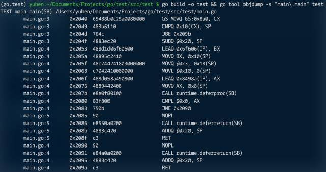

延迟调用（defer）确实是一种 “优雅” 机制。可简化代码，并确保即便发生 panic 依然会被执行。如将 panic/recover 比作 try/except，那么 defer 似乎可看做 finally。

如同异常保护被滥用一样，defer 被无限制使用的例子比比皆是。

```go
package main

import (
	"sync"
  "testing"
)

var m sync.Mutex

func call(){
  m.Lock()
  m.Unlock()
}

func deferCall(){
  m.Lock()
  defer m.Unlock()
}

func BenchmarkCall(b *testing.B){
  for i := 0; i < b.N; i++ {
    call()
  }
}

func BenchmarkDeferCall(b *testing.B){
  for i := 0; i < b.N; i++ {
    deferCall()
  }
}
```

```shell
(go.test)root:~$ go test -v -bench . -benchmem
testing: warning: no tests to run
PASS
BenchmarkCall-4       100000000   22.4 ns/op        0 B/op       0 allocs/op
BenchmarkDeferCall-4  20000000    94.5 ns/op        0 B/op       0 allocs/op
ok     test       4.268s
```

只需稍稍了解 defer 实现机制，就不难理解会有这样的性能差异。

编译器通过 runtime.deferproc “注册” 延迟调用，除目标函数地址外，还会复制相关参数（包括 receiver）。在函数返回前，执行 runtime.deferreturn 提取相关信息执行延迟调用。这其中的代价自然不是普通函数调用一条 CALL 指令所能比拟的。

```go
package main

func main(){
  defer println("xxx")
}
```



或许你会觉得 4x 的性能差异算不得什么，但如果是下面这样呢？

```go
func download(){
  m.Lock()
  defer m.Unlock()
  
  url := queue.Pop()
  httpGet(url)
}
```

当多个 goroutine 执行该函数时，只怕性能差异就不是 4x，还得算上 httpGet 所需时间。原本的并发设计，因为错误的 defer 调用变成 “串行”。

与之类似的，还有下面这样的写法。

```go
func analysis(){
  files := listDir("./log")
  
  for _, name := range files {
    f, err := os.Open(name)
    if err != nil {
      continue
    }
    
    defer f.Close()
    
    // ... do something ...
  }
}
```

如果 files 是个 “超大” 列表，只怕在 analysis 结束前，会有不小的隐式 “资源泄露”，这些不能及时回收的对象，会导致 GC 在内的相关性能问题。

解决方法么，要么去掉 f.close 前的 defer，要么将内层处理逻辑重构为独立函数（比如匿名函数调用）。

```go
func analysis(){
  files := listDir("./log")
  
  for _, name := range files {
    func(){
      f, err := os.Open(name)
    	if err != nil {
      	continue
    	}
    
    	defer f.Close()
    
    	// ... do something ...
    }()
  }
}
```


除此之外，单个函数里过多的 defer 调用可尝试合并。最起码，在并发竞争激烈时，mutex.Unlock 不应该使用 defer，而应尽快执行，仅保护最短的代码片段。
