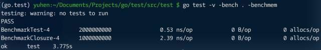
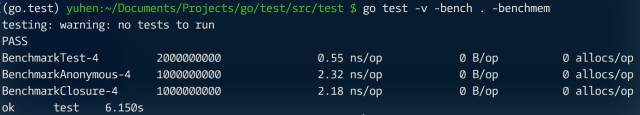
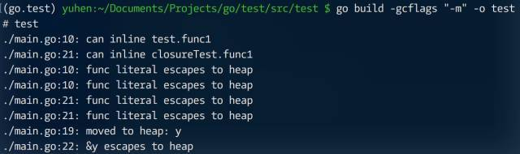
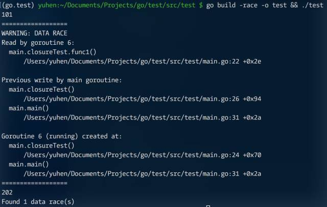

闭包（closure）也是很常见的编码模式，因它隐式携带上下文环境变量，因此可让算法代码变得更加简洁。

```go
package main

import (
	"fmt"
  "time"
)

func timeout(t time.Duration) func() {
  start := time.Now()
  return func(){
    if time.Now().Sub(start) > t {
      panic("timeout")
    }
  }
}

func main(){
  defer timeout(time.Second)()
  
  time.Sleep(time.Second * 2)
  fmt.Println("hello, world!")
}
```

但任何 “便利” 和 “优雅” 的背后，往往都是更复杂的实现机制，无非是语法糖或编译器隐藏了相关细节。最终，这些都会变成额外成本在运行期由 CPU、runtime 负担。甚至因不合理使用，造成性能问题。

用几个代码片段看看可能的麻烦。

```go
package main

import (
	"testing"
)

func test(x int) int {
  return x * 2
}

func BenchmarkTest(b *testing.B) {
  for i := 0; i < b.N; i++ {
    _ = test(i)
  }
}

func BenchmarkClosure(b *testing.B) {
  for i := 0; i < b.N; i++ {
    _ = func() int {
      return i * x
    }()
  }
}
```



单次调用的性能差异有点大（不同环境结果会不同），但这会不会和匿名函数本身构建有关？

```go
package main

import (
	"testing"
)

func test(x int) int {
  return x * 2
}

func BenchmarkTest(b *testing.B) {
  for i := 0; i < b.N; i++ {
    _ = test(i)
  }
}

func BenchmarkClosure(b *testing.B) {
  for i := 0; i < b.N; i++ {
    _ = func(x int) int {
      return 2 * x
    }(i)
  }
}

func BenchmarkClosure(b *testing.B) {
  for i := 0; i < b.N; i++ {
    _ = func() int {
      return i * x
    }()
  }
}
```



似乎是这样。可接下来的问题就更麻烦了。（代码仅作演示，并未保证逻辑一致）

```go
package main

import (
	"time"
)

func test(){
  x := 100
  
  go func(a int) {
    a++
    println(a)
  }(x)
  
  x++
}

func closureTest(){
  y := 200
  
  go func(){
    y++
    println(y)
  }
  
  y++
}

func main(){
  test()
  closureTest()
  
  time.Sleep(time.Second)
}
```

首先，闭包引用原环境变量，导致 y 逃逸到堆上，这必然增加了 GC 扫描和回收对象的数量。



接下来，同样是因为闭包引用原对象，造成数据竞争（data race）。



可见，闭包未必总能将事情 “简单化”。在学习 Go 底层实现过程中，你会了解到，所有 “简单” 都是由编译器或运行时用一堆复杂过程堆出来的。

