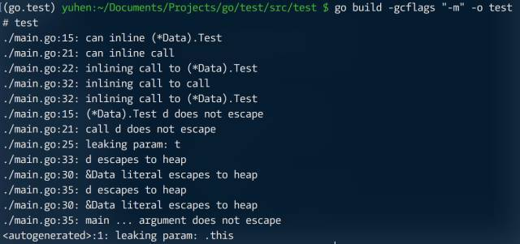
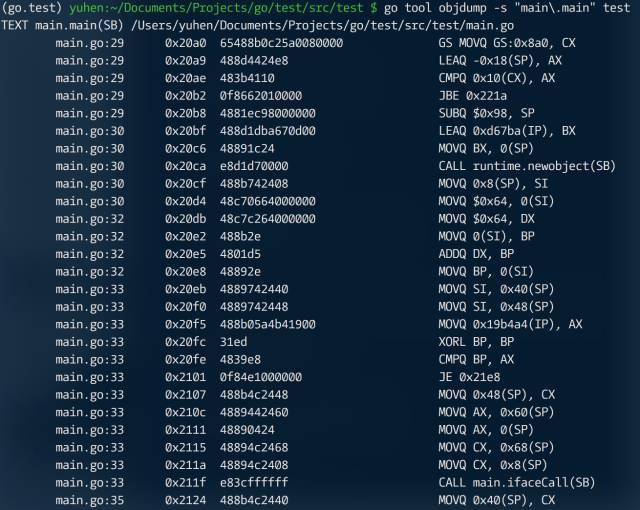
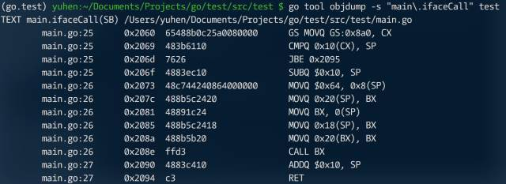

接口的用途无需多言。但这并不意味着可在任何场合使用接口，要知道通过接口调用和普通调用存在很大差别。首先，相比静态绑定，动态绑定性能要差很多；其次，运行期需额外开销，比如接口会复制对象，哪怕仅是个指针，也会在堆上增加一个需 GC 处理的目标。

```go
package main

import (
	"fmt"
)

type Tester interface {
  Test(int)
}

type Data struct {
  x int
}

func (d *Data) Test(x int) {
  d.x += x
}

/*---------------------------------------------*/
func call(d *Data) {
  d.Test(100)
}

func ifaceCall(t Tester) {
  t.Test(100)
}

func main(){
  d = &Data{x: 100}
  
  call(d)
  ifaceCall(d)
  
  fmt.Printf("%+v\n",d)
}
```

```go
package main

import (
  "testing"
)

func BenchmarkCall(b *testing.B) {
  for i := 0; i < b.N; i++ {
    call(&Data{x: 100})
  }
}

func BenchmarkIface(b *testing.B) {
  for i := 0; i < b.N; i++ {
    ifaceCall(&Data{x: 100})
  }
}
```


显然，对于压力很大的内部组件之间，用接口有些得不偿失。

对比接口调用和普通调用的汇编指令，以便有个直观的认识。



普通调用被内联，但接口调用就没有这个待遇了。



就算在 ifaceCall 内部，依然需要通过接口相关机制完成调用。



好了，有关接口的更多细节就不是本文需要阐述的了。总之，做任何选择前，多做测试总归是不坏的。
