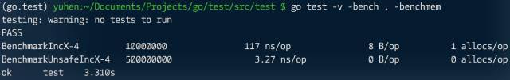
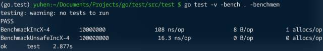

尽管反射（reflect）存在性能问题，但依然被频繁使用，以弥补静态语言在动态行为上的不足。只是某些时候，我们须对此做些变通，以提升性能。

为便于阅读，以下示例均做了最大程度精简。

```go
package main

import (
  "reflect"
)

func incX(d interface{}) int64{
  v := reflect.ValueOf(d).Elem()
  f := v.FieldByName("X")
  
  x := f.Int()
  x++
  f.SetInt(x)
  
  return x
}

func main(){
  d := struct {
    X int
  }{100}
  
  println(incX(&d))
```

如果是 reflect.Type，可将其缓存，避免重复操作耗时。但 Value 显然不行，因为它和具体对象绑定，内部存储实例指针。换个思路，字段相对于结构，除名称（name）外，还有偏移量（offset）这个唯一属性。利用偏移量，将 FieldByName 变为普通指针操作，就可以实现性能提升。

```go
var offset uintptr = 0xFFFF // 避开 offset = 0 的字段

func unsafeIncX(d interface{}) int64{
  if  offset == 0xFFFF {
    t := reflect.TypeOf(d).Elem()
    x, _ := t.FieldByName("X")
    offset = x.Offset
  }
  
  p := (*[2]uintptr)(unsafe.Pointer(&d))
  px := (*int64)(unsafe.Pointer(p[1] + offset ))
  *px++
  
  return *px
}
```

测试一下优化成果。

```go
package main

import (
  "testing"
)

func BenchmarkIncX(b *testing.B){
  d := struct {
    X int
  }{100}
  
  for i := 0; i <  b.N; i++ {
    incX(&d)
  }
}

func BenchmarkUnsafeIncX(b *testing.B){
    d := struct {
    X int
  }{100}
  
  for i := 0; i <  b.N; i++ {
    unsafeIncX(&d)
  }
}
```



效果很好，不是吗？剩余的问题是，如何设计缓存结构，这个 offset 变量自然不能用于实际开发。

用 map[Type]map[name]offset？显然不行。每次执行 reflect.TypeOf，这于性能优化不利。可除了 Type，还有什么可以作为 Key 使用？要知道，接口由 itab 和 data 指针组成，相同类型（接口和实际类型组合）的 itab 指针相同，自然也可当作 key 来用。

```go
var cache = map[*uintptr]map[string]uintptr{}

func unsafeIncX(d interface{}) int64{
  itab := *(**uintptr)(unsafe.Pointer(&d))
  
  m, ok := cache[itab]
  if !ok {
    m = make(map[string]uintptr)
    cache[itab] = m
  }
  
  offset, ok := m["X"]
  if !ok {
    t := reflect.TypeOf(d).Elem()
    x, _ := t.FieldByName("X")
    offset = x.Offset
    
    m["X"] = offset
  }
  
  p := (*[2]uintptr)(unsafe.Pointer(&d))
  px := (*int64)(unsafe.Pointer(p[1] + offseet))
  *px++
  
  return *px
}
```



虽因引入 map 导致性能有所下降，但相比直接使用 reflect 还是提升很多。

> 利用指针类型转换实现性能优化，本就是 “非常手段”，是一种为了性能而放弃 “其他” 的做法。与其担心代码是否适应未来的变化，不如写个单元测试，确保在升级时做出必要的安全检查。还有，本优化系列，仅仅提供一种优化思路，未必要照抄。