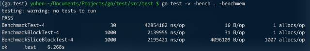

作为内置类型，通道（channel）从运行时得到很多支持，其自身设计也算得上精巧。但不管怎么说，它本质上依旧是一种队列，当多个 goroutine 并发操作时，免不了要使用锁。某些时候，这种竞争机制，会导致性能问题。

下面是一个简单利用 channel 收发数据的示例，为便于 “准确” 测量收发操作性能，我们将 make channel 操作放到外部，尽可能避免额外消耗。

```go
package main

const (
  max = 500000
  bufsize = 100
)

func test(data chan int, done chan struct{}) int {
  count := 0
  
  //接收，统计。
  go func() {
    for x := range data {
      count += x
    }
    
    close(done)
  }()
  
  // 发送
  for i := 0; i < max; i++ {
    data <- i
  }
  
  close(data)
  
  <-done
  return count
}

func main(){
  data := make(chan int, bufsize)
  done := make(chan struct{})
  println(test(data,done))
}
```

在研究 go runtime 源码实现过程中，会看到大量利用 “批操作” 来提升性能的样例。在此，我们可借鉴一下，看看效果对比。

```go
package main

const (
  max = 500000
  bufsize = 100
  block = 500
)

func testBlock(data chan int, done chan struct{}) int {
  count := 0
  
  //接收，统计。
  go func() {
    for x := range data {
      count += x
    }
    
    close(done)
  }()
  
  // 发送
  for i := 0; i < max; i += block {
    var b [block]int
    for n := 0; n < block; n++ {
    	b[n] = i+n
      if i+n == max-1{
        break
      }
    }
    data <- b
  }
  
  close(data)
  
  <-done
  return count
}
```

```go
package main

import (
	"testing"
)

func BenchmarkTest(b *testing.B){
  for i := 0; i < b.N; i++ {
    b.StopTimer()
    data := make(chan int, bufsize)
    done := make(chan struct{})
    b.StartTimer()
    
    _ = test(data, done)
  }
}

func BenchmarkBlockTest(b *testing.B){
  for i := 0; i < b.N; i++ {
    b.StopTimer()
    data := make(chan int, bufsize)
    done := make(chan struct{})
    b.StartTimer()
    
    _ = testBlock(data, done)
  }
}
```


从测试结果看，性能提升很高，可见批操作是一种有效方案。

就此例而言，是否可以使用 slice 代替 array 块？直观上，slice 可减少通过 channel 传递的数据大小，减少数据复制，似乎可进一步提升性能。不妨做个测试。

```go
func testSliceBlock(data chan []int, done chan struct{}) int {
  count := 0
  
    //接收，统计。
  go func() {
    for x := range data {
      count += x
    }
    
    close(done)
  }()
  
  // 发送
  for i := 0; i < max; i += block {
    // 按块打包
    b := make([]int,  block)
    for n := 0; n < block; n++ {
    	b[n] = i+n
      if i+n == max-1{
        break
      }
    }
    data <- b
  }
  
  close(data)
  
  <-  done
  return count
}
```

```go
func BenchmarkSliceBlockTest(b *testing.B){
  for i := 0; i < b.N; i++ {
    b.StopTimer()
    data := make(chan int, bufsize)
    done := make(chan struct{})
    b.StartTimer()
    
    _ = testSliceBlock(data, done)
  }
}
```



其结果和前面某章类似，slice 非但没有提升性能，反而在堆上分配了更多内存，有些得不偿失。当然，这个案例未必就是绝对的，所有的性能提升都需依照具体上下文来分析。

