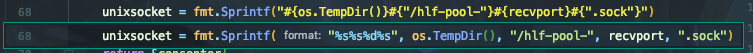

在更新goland到2019.3.3后，查看代码时突然发现下面的写法：
```go
str = fmt.Sprintf("#{os.TempDir()}#{"/hello"}#{recvport}#{".sock"}")
```
正值将go版本更新到go1.14，难道go的语法修改了？我竟然不知道这样写法是什么意思！正准备搜索一下查找答案呢，把鼠标放置到该行代码上面，奇怪发生了：

上图中下面的那一行即为原代码写法，只不过`goland`太过份了，做了不该做的事，这非常不利于查看代码。看着似乎修改了语法。如何解决这一问题呢，打开 Preferences - Editor - General - Code Folding，然后在右侧向下滑到底，在 Go那一分组下面，将 `Format strings`前的对号取消，然后应用，确定就可以了。