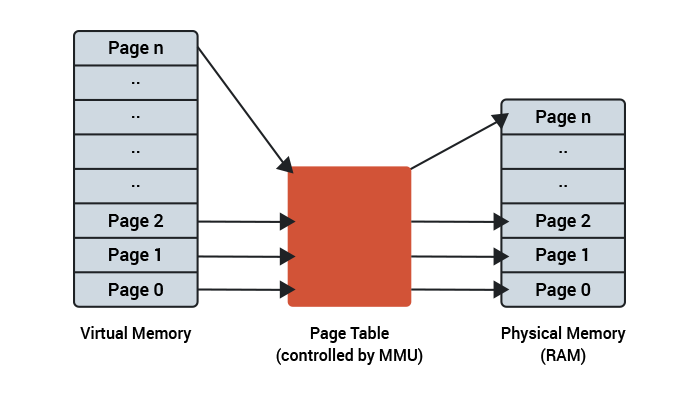
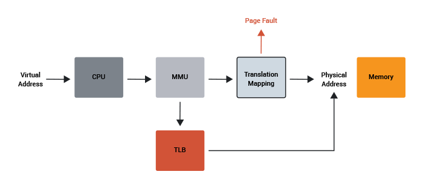
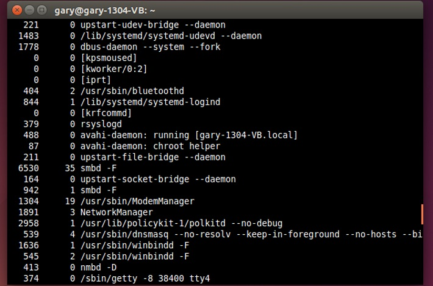
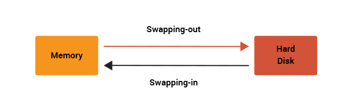
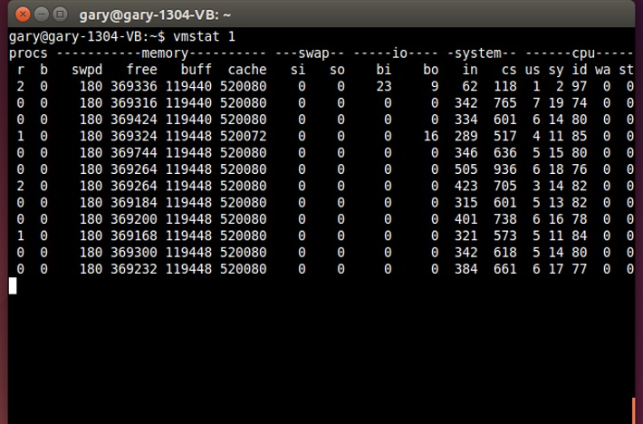

[Understanding page faults and memory swap-in/outs: when should you worry?](https://scoutapm.com/blog/understanding-page-faults-and-memory-swap-in-outs-when-should-you-worry)

想象一下：你的图书馆正努力在时代加强竞争。你不用在书架上浏览，也不用深度记住 Dewey二进制是如何工作的，你可以通过手机输入你选择的书，图书管理员会把书给你带到前台。

在一个繁忙的周末早晨，你下了订单。图书管理员并没有把你所有的书都带过来，而是带了一本回来。有时图书管理员甚至会要求归还图书，让你走出大门为其他人腾地方，让其他人也读一会儿他们的书。然后他们把你叫回来，把你和其他读者推来推去。

发生了什么？图书管理员发疯了吗 ？

这是Linux内存管理单元（图书管理员）和进程（您和其他读者）的一生。当图书管理员需要取书时，就会了生缺页异常。

**如何判断缺页异常是否会减慢您的速度，以及，你如何避免被拖入和移出图书馆？**

# 更多关于页

Linux通过将物理内存切成页来为进程分配内存，然后将这些物理页映射到进程需要的虚拟内存。它与CPU中的内存管理单元(MMU)一起完成这项工作。通常，一个页面将表示4KB的物理内存。保存关于每个页面的统计信息和标志，以告诉Linux该内存块的状态。



这些页可能处于不同的状态。有些被释放（未使用），有些将用于保存可执行代码，有些将作为程序的数据被分配。有许多聪明的算法可以管理这个页列表并控制如何缓存、释放和加载它们。

# 什么是缺页异常？

想象一下在Linux系统上运行很多的程序。程序可执行文件的大小可以用兆字节来度量，但是并不是所有的代码都同时运行。一些代码仅在初始化或一些特殊条件出现时才运行。随着时间的推移，如果Linux认为保存可执行代码的内存页不再被需要或者很少被使用，它就会丢弃这些内存页。因此，即使在程序运行时，也不是所有的机器代码都保存在内存中。

一个程序是由中央处理器执行的，它一步一步地通过机器代码。每条指令都存储在物理内存的某个地址。MMU处理从物理地址空间到虚拟地址空间的映射。在程序执行的某些时候，CPU可能需要寻址不在内存中的代码。**MMU知道该代码的页面不可用(因为Linux告诉它)，因此CPU将引发页面错误**。



这个名字听起来比它实际上更严肃。这不是一个错误，而是一个已知的事件，CPU告诉操作系统它需要对更多代码进行物理访问。

Linux的响应方式是分配更多的页面给进程，用二进制文件中的代码填充这些页面，配置MMU，并告诉CPU继续。

**错页是指你向图书管理员索要《指环王》三部曲的下一本书，图书管理员从书架上取书，并通知你这本书已经在前台了。**

# 小页面错误?

还有一种称为**小页错误的特殊情况，这种情况发生在所需的代码(或数据)实际上已经在内存中，但没有分配给该进程时**。例如，如果用户正在运行web浏览器，那么带有浏览器可执行代码的内存页面可以跨多个用户共享(因为二进制文件是只读的，不能更改)。如果第二个用户启动相同的web浏览器，那么Linux将不会再次从磁盘加载所有二进制文件，它将映射来自第一个用户的可共享页面，并让第二个进程访问这些页面。换句话说，只有在更新页面列表(并配置了MMU)而不需要实际访问磁盘时，才会发生小的页面错误。

**一个小页面错误就是你的朋友想要读你的《双塔奇兵》，而你却说:“嘿，让我们复制一份我的!”或者你还了一本书，但是在书还没被放回书架之前就马上又去借出了。**

# 写时复制？

程序使用的数据内存也会发生类似的情况。一个可执行文件可以要求Linux提供一些内存，比如8兆字节，以便执行一些任务。Linux实际上并没有给进程8兆的物理内存。相反，它分配8兆虚拟内存，并将这些页面标记为**“写时复制”**。这意味着，当它们未被使用时，不需要实际地对它们进行物理分配，但是当进程写到该页时，就会分配一个实际的物理页并将该页分配给进程。

这在多用户、多任务系统中经常发生。物理内存以最有效的方式用于保存进程运行实际需要的内存部分。

**写时复制就是你告诉图书管理员你15分钟后到那里，你到的时候想要《王者归来》。图书管理员会记下书的位置，这样当你到达时他们可以很快找到它。**

# 页面错误发生的频率有多高?

查看Linux系统上主要和次要页面错误数量的最简单方法之一是使用ps命令。试试以下:

```shell
ps -eo min_flt,maj_flt,cmd
```

这将列出系统上当前正在运行的进程，以及每个进程生成的次要和主要页面错误的数量。



查看可执行文件生成的页面错误的方法是使用`/usr/bin/time`命令和`-v`选项。注意:指定`/usr/bin/time`而不仅仅是输入`time`是很重要的，因为您的shell可能有一个`time`命令，它虽然类似，但不会做完全相同的事情。

试试这个:

```shell
/usr/bin/time -v firefox
```

在退出Firefox之后，您将看到一组有关程序如何运行的统计数据。其中包括“主要(需要I/O)页面错误”和“次要(回收帧)页面错误”。第一次运行浏览器时，您可能会看到许多主要的页面错误。在我的测试机器上大约是40。然而，小的页面错误是相当大的，大约30000在我的测试设置。

```shell
Average resident set size (kbytes): 0
Major (requiring I/O) page faults: 33
Minor (reclaiming a frame) page faults: 101353
```

现在，如果您再次运行该命令，您将看到主要错误的数量下降到零，但是次要页面错误仍然很高。这是因为在第二次循环中没有生成页错误，这需要内核从磁盘中获取可执行代码，因为它们仍然在第一次循环时的内存中。然而，当内核发现各种共享库所需的内存页时，小页错误的数量保持不变，并迅速将它们提供给进程。

# 交换（Swapping）

在正常操作下，内核管理内存页，以便将虚拟地址空间映射到物理内存上，并且每个进程都可以访问它需要的数据和代码。但是，当内核没有剩余的物理内存时，会发生什么呢?假设我们希望系统继续运行，那么内核有一个可以使用的技巧。内核将开始将它保存在内存中的一些页面写入磁盘，并使用新释放的页面来满足当前的页面错误。

将页面写入磁盘是一个相对缓慢的过程(与CPU和主内存的速度相比)，但是这比仅仅崩溃或终止进程要好。

将页面写入磁盘以释放内存的过程称为切换-输出。如果稍后由于该页在磁盘上而不是在内存中而引发了一个页错误，那么内核将从磁盘读取该页并满足该页错误。这是换入。



如果系统负载过重，则可能出现不希望出现的情况，即最新的页面错误需要插入一个页面，但仍然没有足够的空闲内存。所以为了满足交换，内核必须先交换出去。在这个阶段存在系统性能下降的危险。如果这只是临时的情况，并且有更多的空闲系统内存可用，那么这不是问题。

然而，还有一种更糟糕的情况。设想这样一种情况，内核必须首先换出一些页面，以便释放一些内存以便换入。但是，由于出现新页面错误，需要重新展开刚刚展开的页面，因此必须再次展开。为了满足这个换页——前几页刚刚被换入——现在被换出。等等。这就是所谓的抖动。当计算机系统开始抖动时，它花在满足主要页面错误上的时间要比实际运行进程的时间多。结果是系统没有响应，硬盘非常繁忙。

可以使用top命令查看系统上使用了多少交换空间，使用vmstat命令查看当前交换 `si`  和交换 `so` 操作的数量。

```shell
vmstat 1sw
```



**交换是指你需要很多书——太多的书放在前台拿不住。图书管理员需要把其余的书存放在地下室的储藏室里，来回要花很长时间。**

## 什么时候应该关心缺页异常和交换？

大多数情况下，**您主要担心的性能问题是高的换入/换出率**。这意味着您的主机没有物理内存来存储所需的页面，并且经常使用磁盘，这比物理内存慢得多。

**应该监视哪些度量标准?**

- 交换活动(交换入和交换出)
- 所使用的交换空间数量

**交换活动是内存访问的主要性能因素**；如果换出的页面属于一个几乎空闲的进程，简单地使用适量的交换空间不一定是问题。但是，当您开始使用大量交换空间时，交换活动影响服务器性能的可能性更大。

## 更多

内核在抢先换出页面方面的攻击性是由一个名为swappiness的内核参数控制的。可以将它设置为从0到100的数字，其中0表示在内存中保存更多的页面，100表示内核应该尝试并换出尽可能多的页面。默认值是60。内核维护者Andrew Morton说他在他的桌面机器上使用了100的swappiness，“我的观点是减少内核交换内容的倾向是错误的。您确实不希望有数百兆的BloatyApp未动内存在机器中四处流动。把它放到磁盘上，用内存做一些有用的事情。”

## TL;DR

- 所有运行进程的虚拟地址空间的总量远远超过物理内存的总量。
- 虚拟地址空间和物理内存之间的映射由Linux内核和CPU的MMU使用内存页来处理。
- 当CPU需要访问不在内存中的页面时，它会引发页面错误。
- 大页错误是只有通过访问磁盘才能满足的错误。
- 一个小的页面错误可以通过共享内存中已经存在的页面来解决。
- 当将页写到磁盘以释放内存以满足主页错误时，就会发生交换。
- 对于页面错误，交换活动是主要的性能问题。

## 更多的服务器?或更快的代码?

添加服务器对于速度较慢的代码来说是一种权宜之计。Scout APM可以帮助你找到并修复低效且昂贵的代码。我们会自动识别N+1 SQL调用、内存膨胀和其他与代码相关的问题，这样您就可以花费更少的调试时间和更多的编程时间。

## 更多参考

- [Restricting process CPU usage using nice, cpulimit, and cgroups](https://scoutapm.com/blog/restricting-process-cpu-usage-using-nice-cpulimit-and-cgroups)
- [Slow Server? This is the Flow Chart You're Looking For](https://scoutapm.com/blog/slow_server_flow_chart)
- [Understanding CPU Steal Time - when should you be worried?](https://scoutapm.com/blog/understanding-cpu-steal-time-when-should-you-be-worried)
- [Understanding Linux CPU Load - when should you be worried?](https://scoutapm.com/blog/understanding-load-averages)